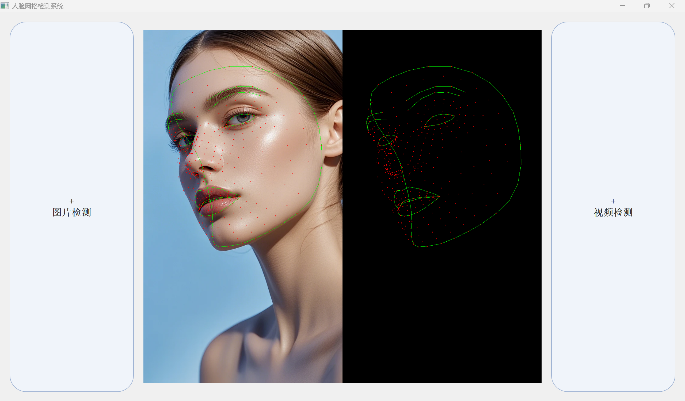

# 人脸网格检测系统

A real-time face mesh detection system using MediaPipe and OpenCV, with a PyQt5-based GUI interface.

## 项目简介

本项目实现了一个基于MediaPipe的人脸网格检测系统，能够实时检测和绘制人脸关键点和轮廓。系统提供了图片检测和视频检测两种模式，并通过直观的GUI界面进行操作。

## 功能特点

- 📷 **图片检测**：支持单张图片的人脸网格检测和可视化
- 🎥 **视频检测**：支持视频文件的实时人脸网格检测
- 🎨 **直观界面**：基于PyQt5的美观GUI界面
- 📊 **实时显示**：实时显示检测结果和FPS
- 🔄 **自适应布局**：界面元素自适应窗口大小变化

## 技术栈

- Python 3.8
- MediaPipe 0.10.11
- OpenCV 4.10
- NumPy 1.24.4
- PyQt5

## 安装说明

### 1. 克隆仓库

```bash
git clone https://github.com/huangfabu/Face-Detection-GUI.git
cd facial detection
```

### 2. 安装依赖

使用pip安装所需依赖：

```bash
pip install mediapipe==0.10.11 opencv-python==4.10 numpy==1.24.4 PyQt5
```

### 3. 下载模型文件

本项目使用MediaPipe的Face Landmarker模型。确保在项目目录中存在 `face_landmarker.task` 文件。

如果模型文件不存在，可以从MediaPipe官方网站下载：
- [MediaPipe Face Landmarker Model](https://developers.google.com/mediapipe/solutions/vision/face_landmarker)

## 使用方法

### 运行GUI应用

```bash
python gui_app.py
```

### 功能操作

1. **图片检测**：点击左侧按钮选择图片文件进行检测
2. **视频检测**：点击右侧按钮选择视频文件进行检测
3. **退出视频播放**：在视频播放过程中按 `Q` 键退出

### 命令行使用

项目也提供了命令行接口，可在 `main.py` 中直接调用：

```python
# 检测图片
detect_image('path/to/image.jpg')

# 检测视频
detect_video('path/to/video.mp4')
```

## 项目结构

```
facial detection/
├── main.py             # 核心检测逻辑
├── gui_app.py          # GUI界面
├── face_landmarker.task # MediaPipe模型文件
├── README.md           # 项目说明文档
└── test files/         # 测试图片和视频
```

## 核心功能

### 人脸网格检测

系统使用MediaPipe的Face Landmarker模型检测人脸关键点，能够：
- 检测多张人脸（最多2张）
- 绘制人脸轮廓线
- 标记关键点位置
- 生成骨架图像

### 实时处理

- 视频检测时实时计算并显示FPS
- 支持窗口大小调整，界面元素自适应

## 示例效果

### 图片检测



### 视频检测


## 注意事项

- 确保模型文件 `face_landmarker.task` 存在于项目根目录
- 视频检测可能会占用较高的系统资源
- 对于高分辨率视频，检测速度可能会降低

## 许可证

MIT License

## 贡献

欢迎提交Issue和Pull Request来改进这个项目！

## 联系方式

如有问题或建议，请通过GitHub Issues与我们联系。